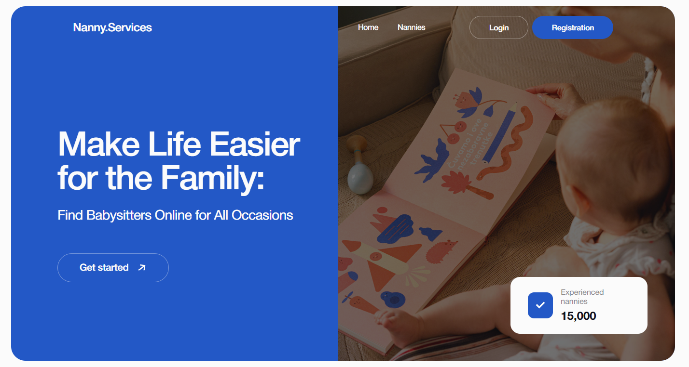
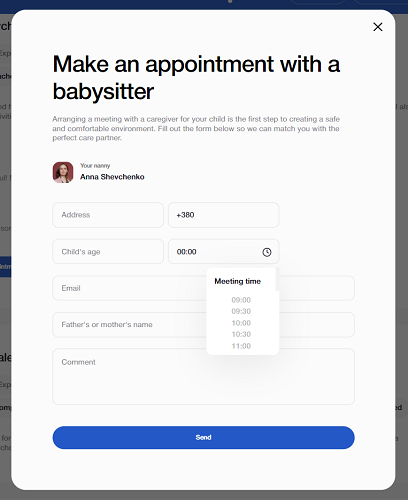
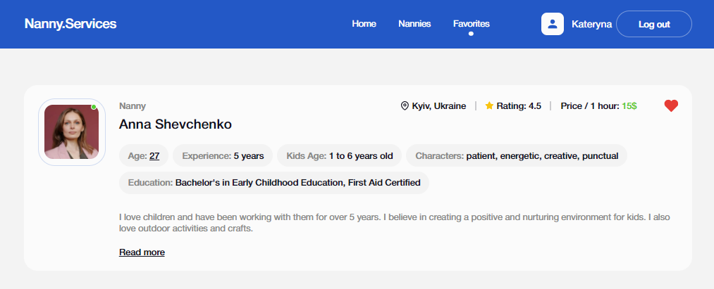

**Читати українською: [Nanny.Services](README_ua.md).** 

# Application Nanny.Services

## Description

Nanny.Services is a web application that allows users to find babysitters for their children. The app consists of three main pages: "Home", "Nannies" and "Favorites".

## Basic technologies

- React.js
- Firebase (Realtime Database and Authentication)
- Formik and Yup for form validation
- React Router for routing

## Homepage

Home: The page contains the site title, company tagline and a link that redirects to the "Nannies" page. Stylization follows the examples given in the layout, with a different color palette.

## Nannies catalog page

Nannies: On this page, the user can view a list of nannies that can be sorted by various parameters: alphabetically, by price, or by popularity. The "Load more" function is also available to load additional babysitter cards.

Click the heart icon to add the list to your favorites.

Click Read more to see detailed information about the babysitter and reviews from parents.

By clicking on the "Make an appointment" button, a modal window opens, in which, by filling in the form fields, you can send a request for an appointment with a nanny.

## Favorites page

Favorites: A page where the user can view babysitter cards that he has added to "favorites".
This page is available only to authorized users.

## Additional Information

The program uses Redux to manage state and Firebase (registration, login, getting user data, logout).

The project is deployed on GitHub Pages.

## Demo

The project is available at the link [Nanny.Services](https://katerynabachkalo.github.io/nanny-services/).

## Technologies used

**Front-end** 
`TypeScript` `React` `React Router` `ReduxToolkit` `ReduxPersist` `Firebase` `nanoid` `HTML/CSS` `react-loader-spinner` `react-toastify` `Formik & Yup` `Responsive design`

**Back-end** 
`Firebase (Realtime Database and Authentication)`
